# Senior High School LMS — Planning Document

A blueprint for building a Learning Management System tailored to Senior High School (Grades 11–12, Tracks/Strands system as used under the Philippine K-12 curriculum, but adaptable to any SHS setup).

---

## 1. Core Modules

### 1.1 User & Role Management
**Function:** Central identity system for Admins, Registrars, Teachers/Advisers, Students, Parents/Guardians, and Guidance Counselors. Handles authentication, role-based access control (RBAC), and profile data.

**Keep in mind:**
- One student may have multiple guardians; one guardian may have multiple children in the system.
- Teachers can be "subject teachers" and/or "advisers" (homeroom) — these are different permission scopes.
- Support account status: active, suspended, graduated, transferred-out.
- Plan for bulk import (CSV) at start-of-year enrollment.

### 1.2 Enrollment & Academic Structure
**Function:** Manages Tracks (Academic, TVL, Sports, Arts & Design), Strands (STEM, ABM, HUMSS, GAS, etc.), Grade Levels (11/12), Sections, and Semesters (SHS runs on 2 semesters/year, not quarters).

**Keep in mind:**
- A student's subjects depend on their Track/Strand + Semester — build this as a rules-driven curriculum map, not hardcoded.
- Handle strand transfers mid-year (rare but happens).
- Track "specialized subjects" vs "core subjects" vs "applied subjects" since SHS curricula separate these.

### 1.3 Class & Scheduling
**Function:** Assigns subjects to sections, teachers to subjects, and generates timetables. Handles room/resource allocation for lab-based strands (STEM, TVL).

**Keep in mind:**
- Conflict detection (teacher double-booked, room double-booked).
- Half-day/shifting schedules (common in public SHS with limited classrooms).
- Immersion/OJT scheduling for TVL and work-immersion requirements — this is a block schedule outside normal classes.

### 1.4 Attendance
**Function:** Daily/per-subject attendance logging, absence/tardy tracking, and automated alerts to guardians.

**Keep in mind:**
- SHS often tracks attendance per subject period, not just once a day.
- Needs an audit trail (who logged/edited an entry and when) — this feeds into official DepEd forms.
- Excessive absence triggers should notify Guidance/Adviser automatically.

### 1.5 Content & Learning Materials
**Function:** Upload/organize modules, videos, slides, and self-learning kits per subject; versioning of materials.

**Keep in mind:**
- Support offline-friendly formats (many SHS students have limited connectivity) — downloadable PDFs, low-bandwidth video links.
- Materials should be scoped by subject + strand + semester, not a flat file dump.
- Access control: draft vs published content.

### 1.6 Assignments, Quizzes & Assessments
**Function:** Create/distribute tasks, auto-graded quizzes (MCQ, T/F), manually-graded essays/performance tasks, rubric-based scoring, submission tracking, plagiarism/late-submission flags.

**Keep in mind:**
- Philippine DepEd grading uses **Written Work, Performance Tasks, and Quarterly/Semestral Exams** with weighted percentages that differ by subject type (Academic Track vs TVL) — the grading engine must support configurable weight templates.
- Support rubric grading for performance-based/portfolio tasks (common in TVL and Arts & Design strands).

### 1.7 Grading & Report Cards
**Function:** Computes final grades using weighted components, generates report cards (equivalent to DepEd SF9/Form 138), computes GPA, and generates official transcripts.

**Keep in mind:**
- Grade computation formulas must be configurable per subject/strand — don't hardcode a single formula.
- Historical grade locking (once a grading period closes, grades shouldn't be silently editable — require an override/audit log).
- Support grade appeals/correction workflow with approval trail.

### 1.8 Communication & Announcements
**Function:** School-wide, section-wide, and subject-specific announcements; direct messaging between teachers/students/guardians; emergency broadcast (e.g., class suspension).

**Keep in mind:**
- Guardians should get a simplified/read-only channel, not full access to internal teacher discussions.
- Push/SMS/email fallback matters — not everyone checks the portal daily.

### 1.9 Calendar & Events
**Function:** Academic calendar, exam schedules, holidays, deadlines, school events, immersion schedules.

**Keep in mind:**
- Should sync per-role (a student sees their own section's events; a teacher sees all sections they handle).

### 1.10 Guidance & Counseling
**Function:** Tracks behavioral records, counseling session logs, career guidance notes (especially relevant since SHS is meant to prepare students for college/work/entrepreneurship).

**Keep in mind:**
- Highest sensitivity data in the system — restrict to Guidance role + Admin only, with strict audit logging.
- Should never be visible to regular subject teachers by default.

### 1.11 Library / Resource Management (optional but common)
**Function:** Digital or physical library catalog, borrowing records, e-book/resource links tied to subjects.

### 1.12 Parent/Guardian Portal
**Function:** View-only access to grades, attendance, announcements, and messaging with teachers.

**Keep in mind:**
- Must support guardians with multiple children — a single login should switch between wards.

### 1.13 Reports & Analytics
**Function:** Dashboards for at-risk students (low grades/attendance), class performance analytics, DepEd-compliant exportable reports.

**Keep in mind:**
- Needs role-scoped dashboards (Admin sees school-wide, Teacher sees their own classes, Guardian sees their child only).

### 1.14 Notifications & Alerts
**Function:** Centralized notification engine (in-app, email, SMS) for deadlines, grades posted, low attendance, announcements.

### 1.15 System Administration
**Function:** School year setup/rollover, curriculum configuration, backup/audit logs, permission management.

**Keep in mind:**
- **School year rollover** is one of the trickiest features — promoting Grade 11 → Grade 12, archiving old sections, carrying forward only the right data (not duplicating). Design this as a first-class workflow, not an afterthought.

---

## 2. Cross-Cutting Considerations

- **Data privacy:** Student data (especially minors) requires strict compliance (e.g., Philippine Data Privacy Act / DPA 2012, or GDPR/FERPA equivalents if international). Encrypt sensitive fields, log all access to guidance/counseling records.
- **Multi-tenancy:** If this LMS will serve multiple schools, isolate data per school (tenant_id) from day one — retrofitting multi-tenancy later is painful.
- **Offline resilience:** Design APIs to tolerate spotty connections (queue submissions, retry uploads).
- **Scalability of grading rules:** Different strands/tracks have different weight formulas — model this as data (a "Grading Template" table), not code.
- **Auditability:** Grades, attendance, and guidance records all need "who changed what, when" trails — build this in from the start, it's expensive to bolt on later.
- **Accessibility:** Screen-reader support and low-bandwidth modes matter for equitable access.
- **Localization:** Support Filipino/English bilingual UI if targeting Philippine public schools.

---

## 3. Suggested Build Phases

1. **Phase 1 — Foundation:** User/Role management, Academic structure (Tracks/Strands/Sections/Subjects), Enrollment.
2. **Phase 2 — Daily Operations:** Scheduling, Attendance, Content/Materials.
3. **Phase 3 — Academics Core:** Assignments/Quizzes, Grading engine, Report Cards.
4. **Phase 4 — Engagement:** Communication, Notifications, Calendar, Parent Portal.
5. **Phase 5 — Oversight:** Guidance module, Reports/Analytics, Library.
6. **Phase 6 — Ops Hardening:** School year rollover, audit logs, backups, multi-tenancy (if needed).

---

## 4. Entity-Relationship Diagram (ERD)

```mermaid
erDiagram
    SCHOOL ||--o{ SCHOOL_YEAR : has
    SCHOOL_YEAR ||--o{ SEMESTER : has
    SCHOOL ||--o{ USER : employs_enrolls

    USER ||--o{ ROLE_ASSIGNMENT : has
    ROLE_ASSIGNMENT }o--|| ROLE : refers_to

    USER ||--o| STUDENT_PROFILE : extends
    USER ||--o| TEACHER_PROFILE : extends
    USER ||--o| GUARDIAN_PROFILE : extends

    GUARDIAN_PROFILE ||--o{ STUDENT_GUARDIAN : links
    STUDENT_PROFILE ||--o{ STUDENT_GUARDIAN : links

    TRACK ||--o{ STRAND : contains
    STRAND ||--o{ CURRICULUM_SUBJECT : defines
    SUBJECT ||--o{ CURRICULUM_SUBJECT : used_in
    SEMESTER ||--o{ CURRICULUM_SUBJECT : offered_in

    SECTION ||--o{ ENROLLMENT : contains
    STUDENT_PROFILE ||--o{ ENROLLMENT : has
    STRAND ||--o{ SECTION : grouped_by
    SCHOOL_YEAR ||--o{ SECTION : belongs_to

    SECTION ||--o{ CLASS_SCHEDULE : has
    SUBJECT ||--o{ CLASS_SCHEDULE : scheduled_as
    TEACHER_PROFILE ||--o{ CLASS_SCHEDULE : teaches
    ROOM ||--o{ CLASS_SCHEDULE : hosts

    CLASS_SCHEDULE ||--o{ ATTENDANCE_RECORD : generates
    STUDENT_PROFILE ||--o{ ATTENDANCE_RECORD : has

    CLASS_SCHEDULE ||--o{ ASSIGNMENT : has
    ASSIGNMENT ||--o{ SUBMISSION : receives
    STUDENT_PROFILE ||--o{ SUBMISSION : submits

    CLASS_SCHEDULE ||--o{ QUIZ : has
    QUIZ ||--o{ QUIZ_QUESTION : contains
    QUIZ ||--o{ QUIZ_ATTEMPT : has
    STUDENT_PROFILE ||--o{ QUIZ_ATTEMPT : takes

    GRADING_TEMPLATE ||--o{ SUBJECT : applied_to
    SUBMISSION ||--o| GRADE_COMPONENT : contributes_to
    QUIZ_ATTEMPT ||--o| GRADE_COMPONENT : contributes_to
    GRADE_COMPONENT }o--|| ENROLLMENT : belongs_to
    ENROLLMENT ||--o{ FINAL_GRADE : computes_to

    CLASS_SCHEDULE ||--o{ LEARNING_MATERIAL : has

    USER ||--o{ ANNOUNCEMENT : posts
    SECTION ||--o{ ANNOUNCEMENT : targeted_to

    USER ||--o{ MESSAGE : sends
    USER ||--o{ MESSAGE : receives

    STUDENT_PROFILE ||--o{ GUIDANCE_RECORD : has
    USER ||--o{ GUIDANCE_RECORD : logged_by

    USER ||--o{ NOTIFICATION : receives
    USER ||--o{ AUDIT_LOG : triggers

    SCHOOL {
        uuid id PK
        string name
        string address
    }
    SCHOOL_YEAR {
        uuid id PK
        uuid school_id FK
        string label
        date start_date
        date end_date
    }
    SEMESTER {
        uuid id PK
        uuid school_year_id FK
        int semester_number
        date start_date
        date end_date
    }
    USER {
        uuid id PK
        string full_name
        string email
        string password_hash
        string status
    }
    ROLE {
        uuid id PK
        string name
    }
    ROLE_ASSIGNMENT {
        uuid id PK
        uuid user_id FK
        uuid role_id FK
        uuid school_id FK
    }
    STUDENT_PROFILE {
        uuid id PK
        uuid user_id FK
        string lrn
        date birth_date
        int grade_level
    }
    TEACHER_PROFILE {
        uuid id PK
        uuid user_id FK
        string employee_id
        string specialization
    }
    GUARDIAN_PROFILE {
        uuid id PK
        uuid user_id FK
        string relationship
        string contact_number
    }
    STUDENT_GUARDIAN {
        uuid id PK
        uuid student_id FK
        uuid guardian_id FK
        boolean is_primary
    }
    TRACK {
        uuid id PK
        string name
    }
    STRAND {
        uuid id PK
        uuid track_id FK
        string name
    }
    SUBJECT {
        uuid id PK
        string name
        string subject_type
    }
    CURRICULUM_SUBJECT {
        uuid id PK
        uuid strand_id FK
        uuid subject_id FK
        uuid semester_id FK
        boolean is_core
    }
    SECTION {
        uuid id PK
        uuid strand_id FK
        uuid school_year_id FK
        string name
        int grade_level
        uuid adviser_id FK
    }
    ENROLLMENT {
        uuid id PK
        uuid student_id FK
        uuid section_id FK
        uuid semester_id FK
        string status
    }
    ROOM {
        uuid id PK
        string name
        string type
    }
    CLASS_SCHEDULE {
        uuid id PK
        uuid section_id FK
        uuid subject_id FK
        uuid teacher_id FK
        uuid room_id FK
        string day_of_week
        time start_time
        time end_time
    }
    ATTENDANCE_RECORD {
        uuid id PK
        uuid class_schedule_id FK
        uuid student_id FK
        date attendance_date
        string status
        uuid logged_by FK
    }
    ASSIGNMENT {
        uuid id PK
        uuid class_schedule_id FK
        string title
        text instructions
        datetime due_date
        int max_score
    }
    SUBMISSION {
        uuid id PK
        uuid assignment_id FK
        uuid student_id FK
        datetime submitted_at
        string file_url
        float score
        string status
    }
    QUIZ {
        uuid id PK
        uuid class_schedule_id FK
        string title
        int time_limit_minutes
    }
    QUIZ_QUESTION {
        uuid id PK
        uuid quiz_id FK
        text question_text
        string question_type
        json options
        string correct_answer
    }
    QUIZ_ATTEMPT {
        uuid id PK
        uuid quiz_id FK
        uuid student_id FK
        float score
        datetime started_at
        datetime submitted_at
    }
    GRADING_TEMPLATE {
        uuid id PK
        string name
        float written_work_weight
        float performance_task_weight
        float exam_weight
    }
    GRADE_COMPONENT {
        uuid id PK
        uuid enrollment_id FK
        string component_type
        float raw_score
        float max_score
    }
    FINAL_GRADE {
        uuid id PK
        uuid enrollment_id FK
        float final_rating
        string remarks
    }
    LEARNING_MATERIAL {
        uuid id PK
        uuid class_schedule_id FK
        string title
        string file_url
        string status
    }
    ANNOUNCEMENT {
        uuid id PK
        uuid posted_by FK
        uuid section_id FK
        string title
        text body
        datetime posted_at
    }
    MESSAGE {
        uuid id PK
        uuid sender_id FK
        uuid receiver_id FK
        text body
        datetime sent_at
    }
    GUIDANCE_RECORD {
        uuid id PK
        uuid student_id FK
        uuid logged_by FK
        string category
        text notes
        datetime created_at
    }
    NOTIFICATION {
        uuid id PK
        uuid user_id FK
        string type
        string message
        boolean is_read
    }
    AUDIT_LOG {
        uuid id PK
        uuid user_id FK
        string action
        string entity_type
        uuid entity_id
        datetime timestamp
    }
```

---

## 5. Notes on the ERD

- **CURRICULUM_SUBJECT** is the key rules table: it defines which subjects belong to which strand, in which semester — this drives auto-scheduling and grading templates.
- **GRADE_COMPONENT** is deliberately generic (component_type: "written_work" | "performance_task" | "exam") so the grading engine can sum/weight them per **GRADING_TEMPLATE** without hardcoding formulas.
- **AUDIT_LOG** is generic/polymorphic (entity_type + entity_id) so it can track changes across grades, attendance, and guidance records from one table.
- **STUDENT_GUARDIAN** is a join table because guardianship is many-to-many (blended families, multiple wards).
- Consider adding a **NOTIFICATION_PREFERENCE** table later if you want per-user control over email/SMS/in-app channels.

---

## 6. Module Flowcharts

Each diagram below shows the core operational flow of that module. All are Mermaid `flowchart` diagrams.

### 6.1 User & Role Management

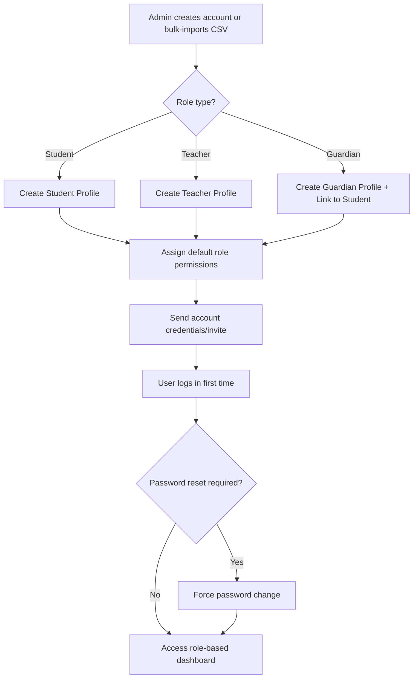

### 6.2 Enrollment & Academic Structure

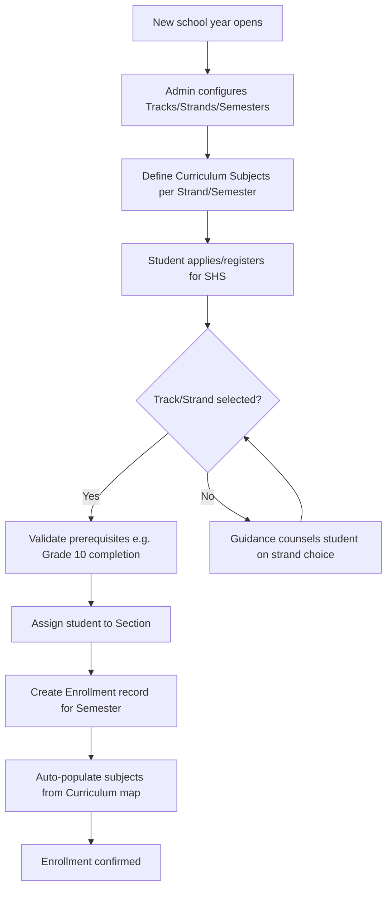

### 6.3 Class & Scheduling

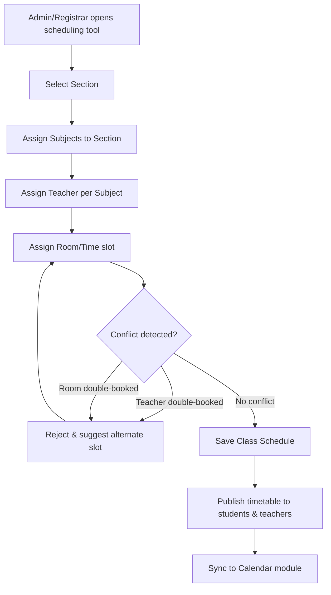

### 6.4 Attendance

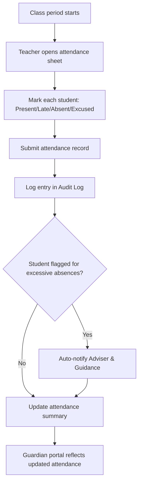

### 6.5 Content & Learning Materials

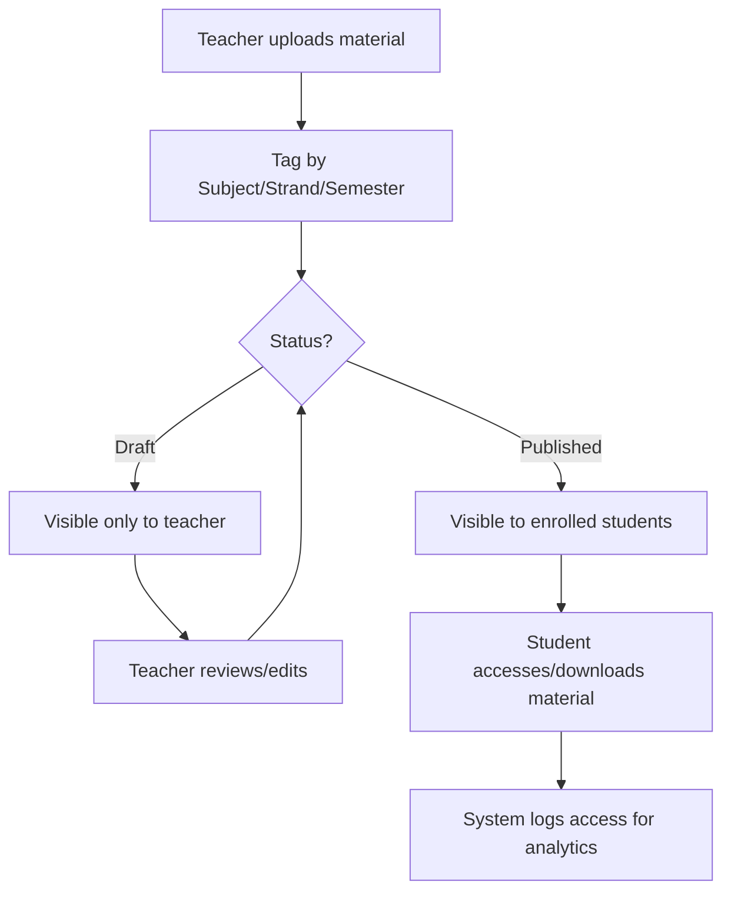

### 6.6 Assignments, Quizzes & Assessments

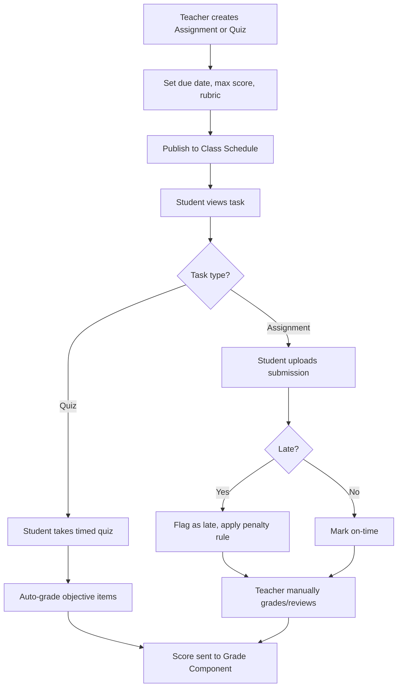

### 6.7 Grading & Report Cards

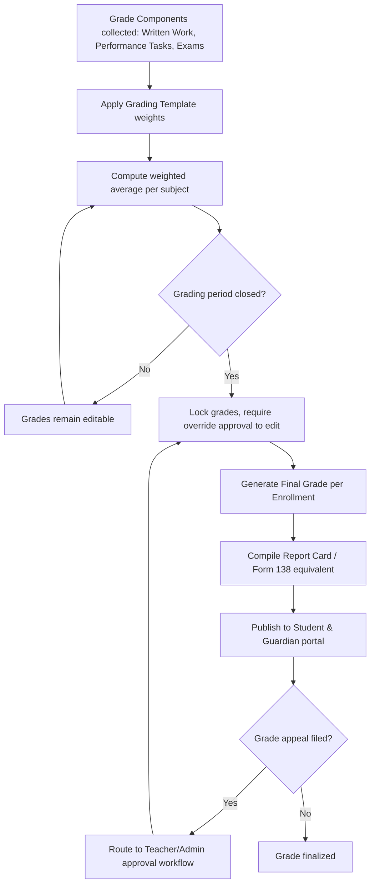

### 6.8 Communication & Announcements

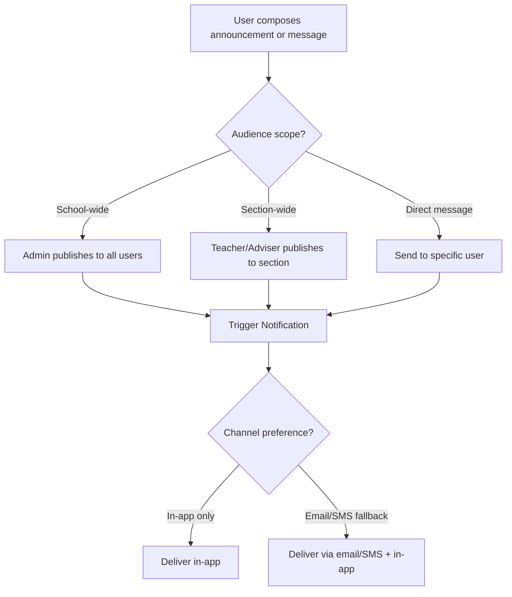

### 6.9 Calendar & Events

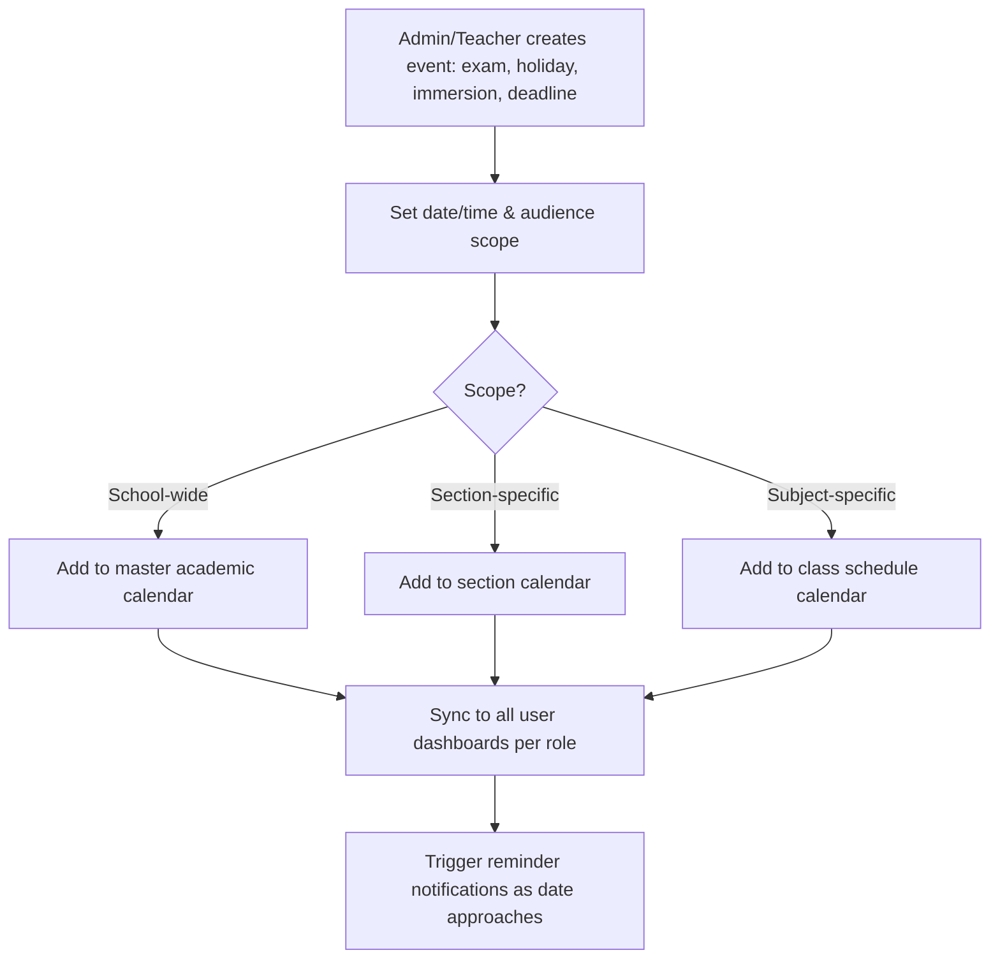

### 6.10 Guidance & Counseling

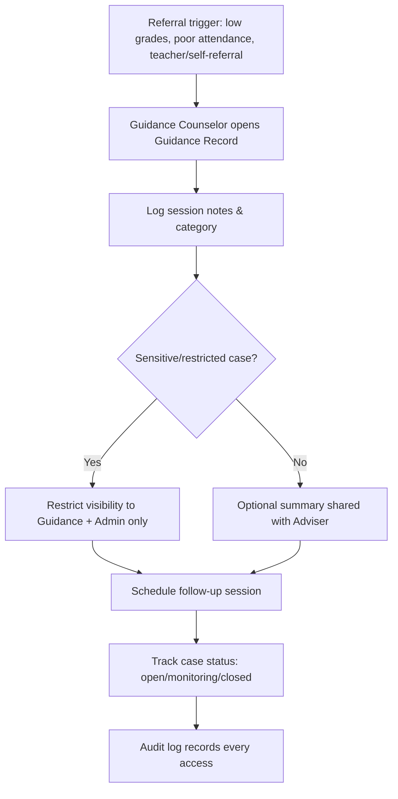

### 6.11 Library / Resource Management

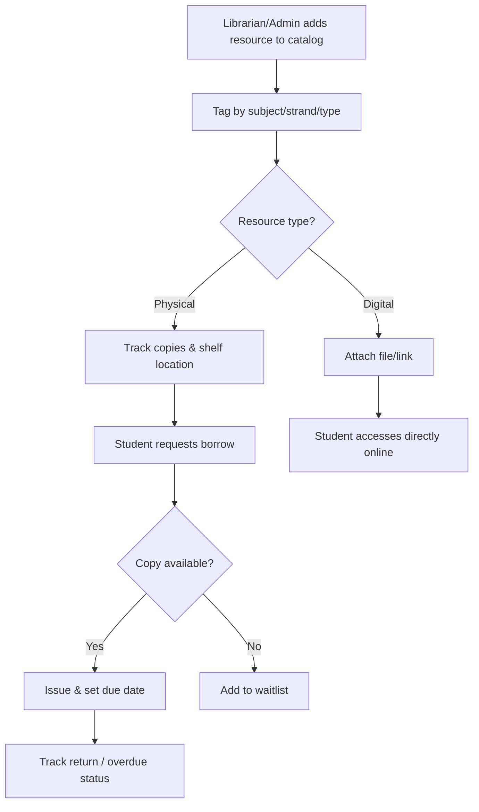

### 6.12 Parent/Guardian Portal

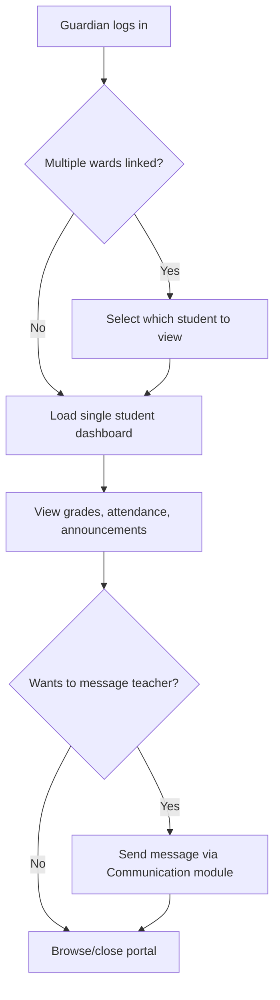

### 6.13 Reports & Analytics

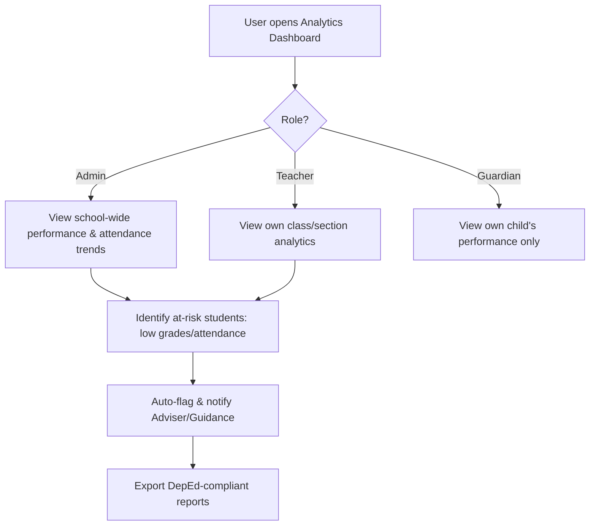

### 6.14 Notifications & Alerts

```mermaid
flowchart TD
    A[Trigger event occurs: grade posted, deadline near, low attendance, announcement] --> B[Notification Engine receives event]
    B --> C[Determine target user(s) by role/relationship]
    C --> D{User channel preference}
    D -->|In-app| E[Push in-app notification]
    D -->|Email| F[Send email]
    D -->|SMS| G[Send SMS]
    E --> H[Mark as read/unread, log in Notification table]
    F --> H
    G --> H
```

### 6.15 System Administration

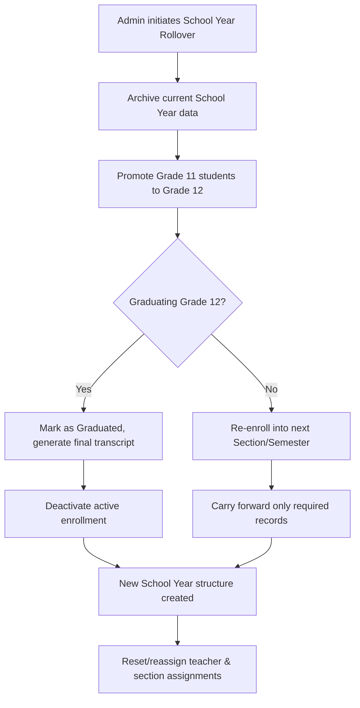

---

## 7. Next Steps Checklist

- [ ] Finalize grading formula rules per DepEd/institution requirements
- [ ] Decide on multi-tenancy (single school vs SaaS for many schools)
- [ ] Choose tech stack (backend framework, DB engine, hosting)
- [ ] Design wireframes for Student, Teacher, Guardian, Admin dashboards
- [ ] Set up role-based access control matrix (who can see/edit what)
- [ ] Plan data migration/import strategy for existing student records
- [ ] Define school year rollover process in detail before writing code
